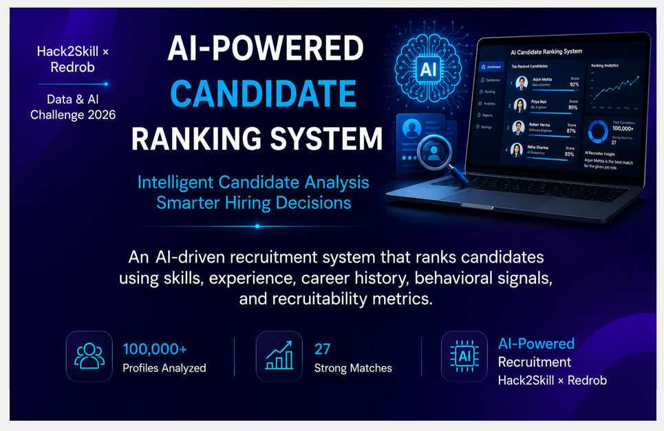
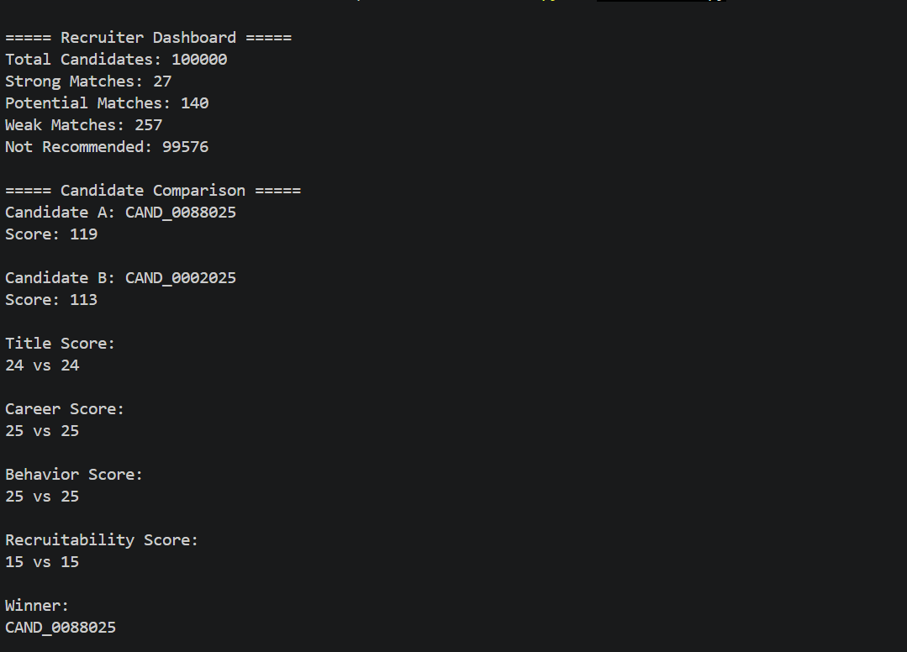
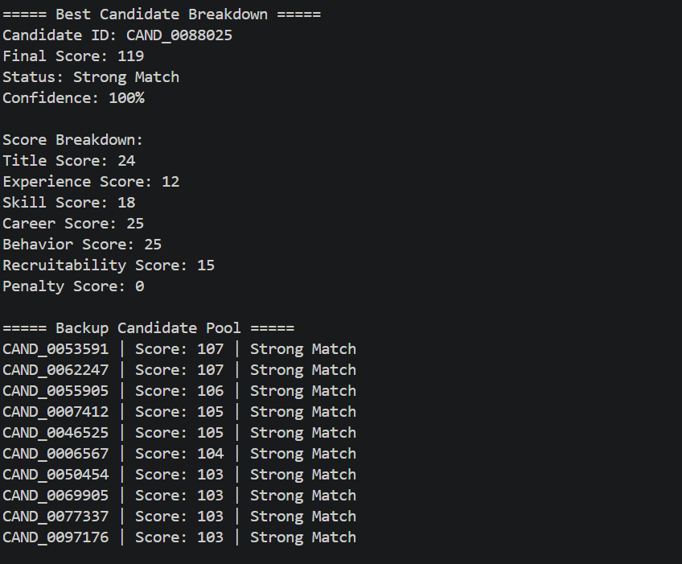
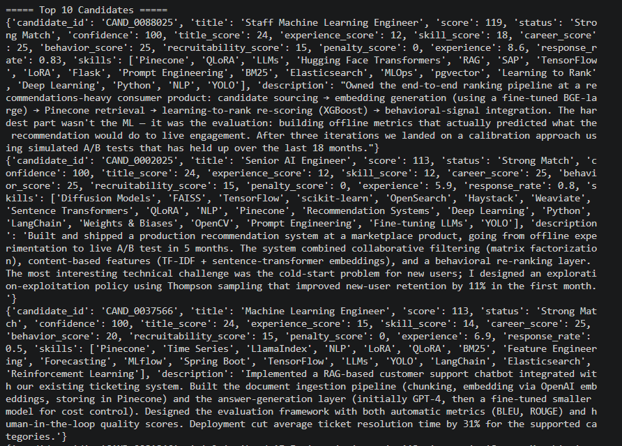

<p align="center">
  
</p>

# AI-Powered Candidate Ranking System

An AI-powered recruitment system that intelligently ranks candidates using skills, experience, career history, behavioral signals, and recruiter response metrics.

---

# Project Preview

## Project Cover


## Recruiter Dashboard



## Best Candidate Breakdown



## Top Ranked Candidates



---

# Overview

The **AI-Powered Candidate Ranking System** is an intelligent recruitment assistant that helps recruiters identify the most suitable candidates from large datasets.

Traditional recruitment relies heavily on manual resume screening and keyword-based filtering, making hiring slow and inconsistent. This project automates candidate evaluation by analyzing multiple factors and generating an explainable AI-based ranking.

The system processes candidate profiles, calculates suitability scores, classifies candidates into different match categories, and generates a ranked shortlist for recruiters.

---

# Problem Statement

Recruiters often need to evaluate thousands of candidate profiles for a single job opening.

Challenges include:

* Manual resume screening
* Large candidate datasets
* Inconsistent hiring decisions
* Difficulty identifying relevant experience
* Lack of recruiter engagement insights
* Time-consuming shortlisting process

---

# Solution

The system evaluates candidates using multiple AI-inspired scoring factors:

* Current Job Title
* Years of Experience
* Technical Skills
* Career History
* Behavioral Signals
* Recruitability Metrics

Based on these factors, candidates are scored, ranked, classified, and recommended.

---

# Key Features

* AI-Based Candidate Ranking
* Multi-Factor Scoring Engine
* Skill Matching
* Experience Analysis
* Career History Evaluation
* Behavioral Signal Analysis
* Recruitability Score
* Confidence Score
* Candidate Comparison
* Missing Skills Detection
* Backup Candidate Pool
* AI Recruiter Recommendation
* CSV Submission Generator

---

# System Architecture

```text
Recruiter Requirement
        │
        ▼
Candidate Dataset (100,000 Profiles)
        │
        ▼
Feature Extraction
        │
        ├── Skills
        ├── Experience
        ├── Career History
        └── Behavioral Signals
        │
        ▼
AI Scoring Engine
        │
        ├── Title Score
        ├── Experience Score
        ├── Skill Score
        ├── Career Score
        ├── Behavior Score
        ├── Recruitability Score
        └── Penalty Score
        │
        ▼
Ranking Engine
        │
        ▼
Candidate Classification
        │
        ▼
Top Candidate Selection
        │
        ▼
Candidate Comparison
        │
        ▼
Missing Skills Analysis
        │
        ▼
AI Recruiter Recommendation
        │
        ▼
submission.csv
```

---

# Technologies Used

* Python
* JSON
* CSV
* Information Retrieval Concepts
* AI-Based Scoring
* Machine Learning Concepts

---

# Folder Structure

```text
AI-Powered-Candidate-Ranking-System/
│
├── assets/
│   ├── cover.png
│   ├── dashboard.png
│   ├── best_candidate.png
│   └── top10_candidates.png
│
├── data/
│   └── candidates.jsonl (Not included due to GitHub size limit)
│
├── output/
│
├── src/
│   ├── ranker.py
│   ├── scoring.py
│   ├── inspect_candidate.py
│   ├── inspect_top5.py
│   ├── inspect_top10.py
│   ├── check_candidate.py
│   ├── check_top_submission.py
│   └── test_load.py
│
├── README.md
├── requirements.txt
└── .gitignore
```

---

# Sample Output

## Recruiter Dashboard

```text
Total Candidates: 100000

Strong Matches: 27
Potential Matches: 140
Weak Matches: 257
Not Recommended: 99576
```

## Best Candidate

```text
Candidate ID : CAND_0088025

Final Score : 119

Status : Strong Match

Confidence : 100%
```

---

# Project Workflow

1. Load Candidate Dataset
2. Extract Candidate Information
3. Analyze Skills
4. Evaluate Experience
5. Analyze Career History
6. Calculate Behavioral Signals
7. Compute Recruitability Score
8. Generate Final Score
9. Rank Candidates
10. Classify Candidates
11. Generate Recruiter Insights
12. Export submission.csv

---

# Installation

Clone the repository:

```bash
git clone https://github.com/Bhanu-sri007/AI-Powered-Candidate-Ranking-System.git
```

Move into the project:

```bash
cd AI-Powered-Candidate-Ranking-System
```

---

# Run the Project

```bash
python src/ranker.py
```

---

# Output

The system generates:

```text
output/submission.csv
```

along with recruiter insights including:

* Recruiter Dashboard
* Best Candidate Breakdown
* Candidate Comparison
* Backup Candidate Pool
* Top Ranked Candidates

---

# Dataset

The original dataset (`candidates.jsonl`) is **not included** in this repository because it exceeds GitHub's 100 MB file size limit.

Place the dataset inside:

```text
data/candidates.jsonl
```

before running the project.

---

# Future Enhancements

* Resume Parsing
* LLM-Based Candidate Evaluation
* NLP Job Description Matching
* Skill Gap Recommendations
* Interview Readiness Prediction
* Candidate Roadmaps
* Explainable AI Dashboard
* Streamlit Web Application
* Cloud Deployment

---

# Business Impact

* Reduces recruiter screening effort
* Improves hiring efficiency
* Enables explainable AI recommendations
* Supports large-scale recruitment
* Improves candidate quality
* Reduces manual bias

---

# Author

**Bhanusri Dunaboina**

Final Year B.Tech – Computer Science and Engineering

Java Full Stack Developer | AI & Machine Learning Enthusiast

GitHub: https://github.com/Bhanu-sri007
